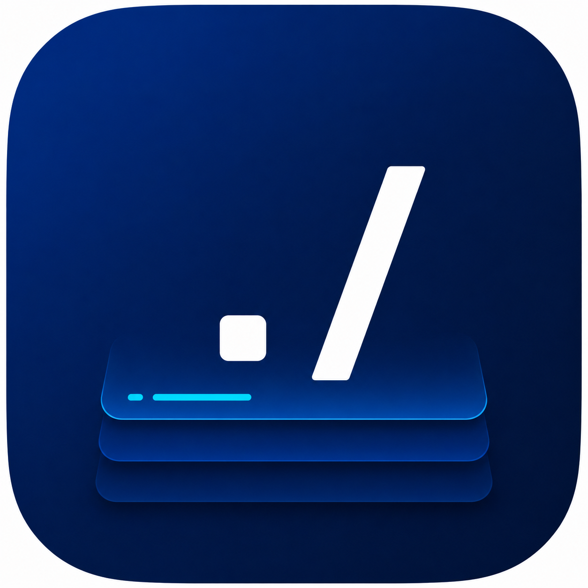

# ScriptsPannel



**ScriptsPannel** — десктопное приложение для Windows: «полки» с вашими скриптами (PowerShell, CMD или свой интерпретатор), настройка автозапуска через планировщик заданий, импорт/экспорт полок в ZIP, светлая/тёмная тема и опциональный фон экрана.

## Скачать релиз

Готовые сборки: **[Releases](https://github.com/YOUR_USERNAME/YOUR_REPO/releases/latest)**  

Замените в этой ссылке `YOUR_USERNAME` и `YOUR_REPO` на свой GitHub-пользователь и имя репозитория (или вставьте прямую ссылку на последний релиз после публикации).

Обычно в релиз выкладывают zip с `ScriptsPannel.exe` (например, после `dotnet publish` с `--self-contained` / single-file — как настроите в CI).

## Иконка приложения и картинка для README

1. **Иконка для .exe**  
   - Конвертируйте изображение в формат **`.ico`** (в Windows удобно через онлайн-конвертер или Visual Studio: добавить PNG → экспорт иконок).  
   - Сохраните файл как:  
     `ScriptsPannel/Assets/app.ico`  
   - После этого при следующей сборке иконка подставится в исполняемый файл автоматически (см. `ApplicationIcon` в `ScriptsPannel.csproj`).  
   - Если `app.ico` ещё нет, проект собирается как раньше, без своей иконки.

2. **Картинка в этом README**  
   - Экспортируйте ту же иконку (или баннер) в **PNG**, желательно квадрат **от 128×128 px**.  
   - Сохраните как:  
     `ScriptsPannel/Assets/readme-icon.png`  
   - В README используется путь `ScriptsPannel/Assets/readme-icon.png` относительно корня репозитория — так GitHub корректно покажет изображение на главной странице репозитория.

## Сборка из исходников

Требуется [.NET SDK](https://dotnet.microsoft.com/download) (проект нацелен на `net10.0-windows`).

```powershell
cd ScriptsPannel
dotnet build -c Release
dotnet run --project .\ScriptsPannel\ScriptsPannel.csproj
```

Публикация (пример):

```powershell
dotnet publish .\ScriptsPannel\ScriptsPannel.csproj -c Release -r win-x64 --self-contained true -o .\publish
```

## Лицензия

Укажите здесь свою лицензию (MIT, GPL и т.д.), когда определитесь.
